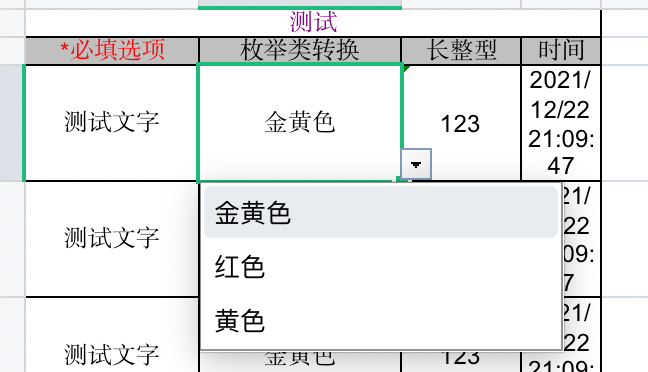
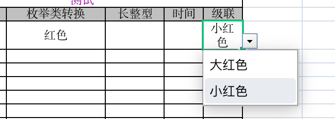
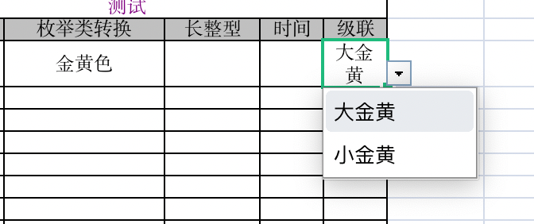
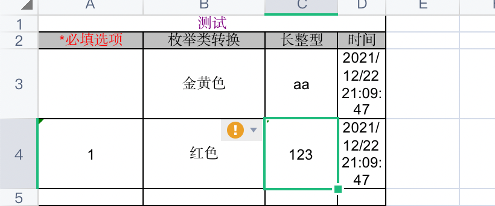
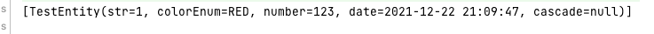
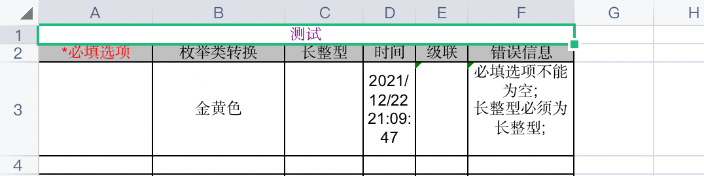

# 项目简述

no-excel是一个excel导入导出工具类，提供基于注解方式使用，并提供了excel下拉框和级联下拉框的生成，同时对基本类型包括时间枚举提供了自动转换的功能，旨在提供简单便捷通用的excel导入导出功能。

# 快速开始

引入no-excel依赖

```xml
<dependency>
  <groupId>io.github.amerainc</groupId>
  <artifactId>no-excel</artifactId>
  <version>2021.12.24</version>
</dependency>
```

首先创建一个测试用的实体类(测试样例在test文件夹下)

```java
@ExcelEntity(title = "测试")
@Data
public class TestEntity{
    //require选项必填时输出会带有*好，读取时无必填字段则会抛出异常
    @ExcelField(name = "必填选项", require = true)
    private String str;
    //在枚举类的情况下,param参数可以指定excel写入读取时使用的枚举类属性
    @ExcelField(name = "枚举类转换", param = "i18n")
    private ColorEnum colorEnum;
    @ExcelField(name = "长整型")
    private Long number;
    @ExcelField(name = "时间")
    private Date date;
}
```

```java
public enum ColorEnum {
    RED("红色"),
    GOLD("金黄色"),
    YELLOW("黄色");
    String i18n;
    ColorEnum(String i18n){
        this.i18n = i18n;
    }
    public String getI18n() {
        return i18n;
    }
}
```

## excel导出

为了能够重复使用，工具类在导出后并不会主动将workbook关闭，工具类也同时实现了closeable接口，因此建议使用try-resource的方式来使用。

### 普通导出

```java
   @Test
    public void writeFile() {
        //初始化要写入的数据
        List<TestEntity> testEntityList = new ArrayList<>();
        TestEntity testEntity = new TestEntity();
        testEntity.setDate(new Date());
        testEntity.setStr("测试文字");
        testEntity.setNumber(123L);
        testEntity.setColorEnum(ColorEnum.GOLD);
        for (int i = 0; i < 100; i++) {
            testEntityList.add(testEntity);
        }
      
        //写入
        ExcelWriterBuilder<TestEntity> builder = ExcelWriterBuilder.builder(TestEntity.class);
        try (ExcelWriter<TestEntity> excelWriter = builder.build()) {
            excelWriter.writeDataAndClose(testEntityList, new FileOutputStream("createFile.xls"));
        } catch (IOException e) {
            e.printStackTrace();
        }
    }
```

导出的文件如下图所示，同时枚举类则会生成下拉菜单



### 导出模板

如果不是为了导出数据，只是为了提供一份供用户填写的模板，也可以直接调用写入模板的方法。

```java
    @Test
    public void writeTemplate() {
        //构造模板
        try (ExcelWriter<TestEntity> excelWriter = ExcelWriterBuilder.builder(TestEntity.class).build();
             FileOutputStream fileOutputStream = new FileOutputStream("createTemplate.xls")) {
            excelWriter.writeTemplate(fileOutputStream);
        } catch (IOException e) {
            e.printStackTrace();
        }
    }
```

导出的文件如下图所示


### web导出

同时也提供了web方式的导出

```java
    @GetMapping("/test")
    public void test(HttpServletRequest request, HttpServletResponse response) {
        try (ExcelWriter<TestEntity> excelWriter = ExcelWriterBuilder.builder(TestEntity.class).build()) {
            excelWriter.writeTemplateToResponse("测试.xls",request,response);
        }
    }
```

## excel导入

直接读取将数据转换成实体类列表返回

```java
    @Test
    public void readFile() {
        String path = getClass().getResource("/").getPath();
        ExcelReaderBuilder<TestEntity> builder = ExcelReaderBuilder.builder(TestEntity.class);
        try (ExcelReader<TestEntity> excelReader = builder.build(new File(path + "readFile.xls"))) {
            List<TestEntity> testEntities = excelReader.readData();
            System.out.println(testEntities);
        }
    }
```

同时也提供了消费者模式进行消费，消费者模式下将会对数据逐行进行转换，并直接通过消费者进行消费

```java
    @Test
    public void readFile2() {
        String path = getClass().getResource("/").getPath()+"readFile.xls";
        ExcelReaderBuilder<TestEntity> builder = ExcelReaderBuilder.builder(TestEntity.class);
        try (ExcelReader<TestEntity> excelReader = builder.build(new File(path))) {
           excelReader.readData(testEntity -> {
               System.out.println(testEntity);
           });
        }
    }
```

如果处理比较耗时，也可以采用多线程的方式分片进行处理

```java
    @Test
    public void readFile3() {
        ExecutorService executorService = Executors.newFixedThreadPool(5);
        String path = getClass().getResource("/").getPath()+"readFile.xls";
        ExcelReaderBuilder<TestEntity> builder = ExcelReaderBuilder.builder(TestEntity.class);
        try (ExcelReader<TestEntity> excelReader = builder.build(new File(path))) {
            //这里将数据分为五片，并交由五个线程处理
            excelReader.readDataConcurrent(testEntity -> {
                System.out.println(testEntity);
            },executorService,5);
        }
    }
```

# 注解

## @ExcelEntity

在用来承载excel数据的实体类上使用，用于指定一些全局性的参数

```java
@ExcelEntity(title = "测试")
@Data
public class TestEntity{
    //require选项必填时输出会带有*好，读取时无必填字段则会抛出异常
    @ExcelField(name = "必填选项", require = true)
    private String str;
    //在枚举类的情况下,param参数可以指定excel写入读取时使用的枚举类属性
    @ExcelField(name = "枚举类转换", param = "i18n")
    private ColorEnum colorEnum;
    @ExcelField(name = "长整型")
    private Long number;
    @ExcelField(name = "时间")
    private Date date;
}
```

| 属性             | 类型                           | 必填 | 默认值                                        | 说明                                                |
| ---------------- | ------------------------------ | ---- | --------------------------------------------- | --------------------------------------------------- |
| title            | String                         | 是   |                                               | excel导出时显示的标题名                             |
| showTitle        | boolean                        | 否   | true                                          | excel导出时是否有标题                               |
| showHead         | boolean                        | 否   | true                                          | excel导出时是否有表头                               |
| maxSize          | int                            | 否   | 500                                           | excel导入时读取的最大数据量限制，超出限制会抛出异常 |
| titleStyle       | Class<? extends StyleProvider> | 否   | DefaultTitleStyleProvider.class               | 标题使用的excel样式                                 |
| headRequireStyle | Class<? extends StyleProvider> | 否   | DefaultHeadRequireStyleProviderProvider.class | 当字段为必填时，标题显示的样式                      |
| headStyle        | Class<? extends StyleProvider> | 否   | DefaultHeadStyleProvider.class                | 普通表头样式                                        |
| dataStyle        | Class<? extends StyleProvider> | 否   | DefaultDataStyleProvider.class                | 数据样式                                            |

## @ExcelField

在需要导入导出的字段上进行使用，用于定义字段相关的信息

| 属性          | 类型                               | 必填 | 默认值                      | 说明                                                         |
| ------------- | ---------------------------------- | ---- | --------------------------- | ------------------------------------------------------------ |
| name          | String                             | 是   |                             | 字段名称，与excel表头对应                                    |
| sort          | int                                | 否   | 0                           | 字段的输出顺序                                               |
| require       | boolean                            | 否   | false                       | 字段是否必填，必填时输出表头会带有*号，读取时无必填字段则会抛出异常 |
| converter     | Class<? extends FieldConverter<?>> | 否   | DefaultFieldConverter.class | 字段转换器，用于提供excel字段和实体类字段之间的转换          |
| param         | String                             | 否   | ""                          | 用于提供给字段转换器额外的处理参数                           |
| cascadeDepend | String                             | 否   | ""                          | 级联依赖字段的字段名(不填默认依赖前一个字段)                 |

# 功能

## 字段转换器

### FieldConverter

FieldConverter接口用于提供excel字段和实体类字段之间的转换，实现这个接口可以自定义字段转换的规则

#### parseToField(必须实现)

实现parseToField方法，用于提供excel数据转换成对应字段值的功能，下面以默认的Integer转换器为例

```java
    @Override
    public Integer parseToField(String excelData) {
        try {
            return Integer.parseInt(excelData);
        } catch (NumberFormatException numberFormatException) {
            throw new NoExcelException("必须为整型");
        }
    }
```

#### parseToExcelData(必须实现)

实现parseToExcelData方法用于提供将字段值转换为excel数据的功能

```java
    @Override
    public String parseToExcelData(Integer fieldData) {
        return fieldData.toString();
    }
```

#### initData

initData方法会在转换器初始化调用，以默认的日期转换器为例，在初始化时可以通过填写注解上param来指定输出到excel的日期格式

```java
public class DefaultDateFieldConverter implements FieldConverter<Date> {
    /**
     * 输出时的日期格式
     */
    private String printDateFormat = "yyyy/MM/dd HH:mm:ss";
 											......
    @Override
    public String parseToExcelData(Date fieldData) {
        return DateFormatUtil.formatDate(fieldData, this.printDateFormat);
    }

    @Override
    public void initData(ExcelFieldMeta excelFieldMeta) {
        //如果有参数则使用参数作为日期格式
        if (StrUtil.isNotBlank(excelFieldMeta.getParam())) {
            this.printDateFormat = excelFieldMeta.getParam();
        }
    }
```


#### match(用于默认字段转换器)

match方法用于默认字段转换器进行匹配使用，如果是在注解上直接指定的转换器则无需实现

```java
    default boolean match(ExcelFieldMeta excelFieldMeta) {
        Class<?> firstGenericType = GenericUtil.getFirstGenericType(this.getClass());
        return firstGenericType != null && firstGenericType.isAssignableFrom(excelFieldMeta.getFieldClz());
    }
```

#### order(用于默认字段转换器)

order方法用于决定默认字段转换器进行匹配时优先级越小优先级越高

```java
    default int order() {
        return 0;
    }
```

#### isSingleton

项目对字段转换器做了缓存，通过isSingleton觉得当前字段转换器在使用时是否为单例，默认为非单例。如整型等不需要配置的转换器使用了单例，而日期转换器可以自定义输出格式，使用了非单例的形式。

```java
    @Override
    default boolean isSingleton(){
        return false;
    }
```

### DefaultFieldConverter(默认字段转换器)

DefaultFieldConverter是注解中默认使用的字段转换器，DefaultFieldConverter是一个代理类，通过match方法对所有的默认字段转换器进行匹配并实现代理。

DefaultFieldConverter通过spi的方式将所有的默认字段转换器放入匹配列表，并在使用时通过init方法进行初始化匹配到对应的默认字段转换器进行代理，匹配逻辑为由order决定转换器的匹配顺序，并通过match方法匹配使用首个匹配成功的字段转换器

spi如下，目前总共实现了8个默认字段转换器


```
com.rainc.noexcel.convert.impl.DefaultDateFieldConverter
com.rainc.noexcel.convert.impl.DefaultDoubleFieldConverter
com.rainc.noexcel.convert.impl.DefaultEnumFieldConverter
com.rainc.noexcel.convert.impl.DefaultIntegerFieldConverter
com.rainc.noexcel.convert.impl.DefaultLongFieldConverter
com.rainc.noexcel.convert.impl.DefaultShortFieldConverter
com.rainc.noexcel.convert.impl.DefaultStringFieldConverter
com.rainc.noexcel.convert.impl.DefaultObjectFieldConvert
```

如果想要自己的字段转换器也能通过DefaultFieldConverter进行代理，则在项目的`resoures/META-INF/services`下创建文件，文件名为`com.rainc.noexcel.convert.FieldConverter`，并在文件中写上自定义的字段转换器的全类名

### BaseMapFieldConverter(基础字段映射转换器)

BaseMapFieldConverter是字段映射转换器的抽象类，实现BaseMapFieldConverter可以轻松实现枚举字典等具有映射关系的数据转换，并且在导出时可以通过映射值生成excel的下拉框选项

继承BaseMapFieldConverter并实现方法fieldToExcelDataMap，通过实现这个方法并返回一个实体类字段到excel字段的数据映射表

下面用默认的枚举字段转换器为例，返回的键是枚举值，值在没有定义param的情况下默认用name,同时也可以通过param来指定excel的字段。同时使用LinkedHashMap是因为生成下拉框数据时会使用到map的values，用LinkedHashMap可以保证下拉框列表的顺序。

```java
public class DefaultEnumFieldConverter extends BaseMapFieldConverter<Enum<?>> {

    @Override
    @SneakyThrows
    public Map<Enum<?>, String> fieldToExcelDataMap(ExcelFieldMeta excelFieldMeta) {
        Class<Enum<?>> fieldClz = (Class<Enum<?>>) excelFieldMeta.getFieldClz();
        String param = excelFieldMeta.getParam();
        Enum<?>[] enums = fieldClz.getEnumConstants();
        return Arrays.stream(enums).collect(Collectors.toMap(anEnum -> anEnum, anEnum -> {
            if (StrUtil.isEmpty(param)) {
                return anEnum.name();
            } else {
                return ReflectUtil.getFieldValue(anEnum, param).toString();
            }
        },(a,b)->a, LinkedHashMap::new));
    }
}
```


### BaseCascadeConverter(基础级联字段转换器)

BaseCascadeConverter是级联字段转换器的抽象类，是在字段映射转换器的基础上实现的，可以用来生成带有级联下拉框的excel字段。

继承BaseCascadeConverter并实现cascadeMap，返回一个格式为`Map<级联的excel值,Map<属性值,excel值>>`的映射表即可实现级联的下拉框选项

下面实例实现了BaseCascadeConverter，手动创建了一个和之前的ColorEnum进行级联的map数据

```java
public class CascadeConverter extends BaseCascadeConverter<String> implements CascadeProvider {
    @Override
    public Map<String, Map<String, String>> cascadeMap(ExcelFieldMeta excelFieldMeta) {
        Map<String, Map<String, String>> map = new LinkedHashMap<>();
        Map<String, String> red = new LinkedHashMap<>();
        red.put("bred","大红色");
        red.put("sred","小红色");
        Map<String, String> yellow = new LinkedHashMap<>();
        yellow.put("byellow","大黄色");
        yellow.put("syellow","小黄色");
        Map<String, String> gold = new LinkedHashMap<>();
        gold.put("bgold","大金黄");
        gold.put("sgold","小金黄");
        map.put("红色",red);
        map.put("黄色", yellow);
        map.put("金黄色",gold);
        return map;
    }
}
```

在测试用的实体类中增加级联字段用来测试，将converter设置为自定义的CascadeConverter同时将级联的依赖字段选为枚举类转换字段

```java
@ExcelEntity(title = "测试")
@Data
public class TestEntity{
    //require选项必填时输出会带有*号，读取时无必填字段则会抛出异常
    @ExcelField(name = "必填选项", require = true)
    private String str;
    //在枚举类的情况下,param参数可以指定excel写入读取时使用的枚举类属性
    @ExcelField(name = "枚举类转换", param = "i18n")
    private ColorEnum colorEnum;
    @ExcelField(name = "长整型")
    private Long number;
    @ExcelField(name = "时间")
    private Date date;
    @ExcelField(name = "级联",converter = CascadeConverter.class,cascadeDepend = "枚举类转换")
    private String cascade;
}
```

使用ExcelWriter的writeTemplate方法导出excel模板并查看，级联效果如下





## 错误行校验

工作中经常有业务是用户直接通过excel的形式进行批量的导入操作，由于excel不可控，所以总是会产生一些错误的数据，错误行校验功能与字段转换功能紧密贴合，在字段转换时达到字段的校验功能

需要使用错误行校验首先实体类继承BaseErrMsg，BaseErrMsg用来存储校验的错误信息

```java
@ExcelEntity(title = "测试")
@Getter
@Setter
@ToString
public class TestEntity extends BaseErrMsg {
    //require选项必填时输出会带有*号，读取时无必填字段则会抛出异常
    @ExcelField(name = "必填选项", require = true)
    private String str;
    //在枚举类的情况下,param参数可以指定excel写入读取时使用的枚举类属性
    @ExcelField(name = "枚举类转换", param = "i18n")
    private ColorEnum colorEnum;
    @ExcelField(name = "长整型")
    private Long number;
    @ExcelField(name = "时间")
    private Date date;
    @ExcelField(name = "级联",converter = CascadeConverter.class,cascadeDepend = "枚举类转换")
    private String cascade;
}
```

然后再字段转换器中校验不符合的地方抛出NoExcelException异常，工具类就会捕获这个异常并写入到BaseErrMsg的属性中，以默认长整型转换器为例，在解析Integer失败时抛出了必须为长整型的异常

```java
    @Override
    public Long parseToField(String excelData) {
        try {
            return Long.parseLong(excelData);
        } catch (NumberFormatException numberFormatException) {
          throw new NoExcelException("必须为长整型");
        }
    }
```

这里尝试读取下面的数据，下面第一行数据有两处错误，必填选项未填，长整型也不对



下面的代码读取了这个失败文件并将成功的数据和失败的数据分离，在控制台输出成功的数据，并将失败数据导出到errFile.xls

```java
 @Test
    public void readerrorFile() {
        //读取excel
        String path = getClass().getResource("/").getPath()+"readerrFile.xls";
        ExcelReaderBuilder<TestEntity> builder = ExcelReaderBuilder.builder(TestEntity.class);
        List<TestEntity> testEntities;
        try (ExcelReader<TestEntity> excelReader = builder.build(new File(path))) {
            testEntities = excelReader.readData();
        }
        //过滤成功的数据
        List<TestEntity> success = testEntities.stream().filter(BaseErrMsg::hasNotErrMsg).collect(Collectors.toList());
        System.out.println(success);
        //过滤成功的数据
        List<TestEntity> error = testEntities.stream().filter(BaseErrMsg::hasErrMsg).collect(Collectors.toList());
        //将失败的数据重新导成excel
        try (ExcelWriter<TestEntity> excelWriter = ExcelWriterBuilder.builder(TestEntity.class).build()) {
            excelWriter.writeDataAndClose(error,new FileOutputStream("errFile.xls"));
        } catch (FileNotFoundException e) {
            e.printStackTrace();
        }
    }
```

可以看到结果如下图，控制台输出了成功的数据行，而excel中的导出了错误行，并且含有错误行的错误信息





## 忽略字段

有时候导入导出希望动态的选择某些字段，而不是对标有注解的字段进行全量的导入导出，比如继承了BaseErrMsg后，在生成模板或导入数据时并不希望有错误信息行的出现，导入数据时也不希望读到excel中的错误信息

### ignoreWithFieldName

通过Builder上提供的ignoreWithFieldName方法可以在导入导出时忽略这些字段，列如忽略错误信息经常用到，因此也提供了一个快捷方法

```java
    public Builder ignoreErrMsg() {
        return this.ignoreWithFieldName(BaseErrMsg::getErrMsg);
    }
```

使用如下，忽略指定行后构建实例，即可

```java
    @Test
    public void writeTemplate() {
        //构造模板
        try (ExcelWriter<TestEntity> excelWriter = ExcelWriterBuilder.builder(TestEntity.class)
                //忽略errMsg行
                .ignoreErrMsg()
                //构建
                .build();
             FileOutputStream fileOutputStream = new FileOutputStream("createTemplate.xls")) {
            excelWriter.writeTemplate(fileOutputStream);
        } catch (IOException e) {
            e.printStackTrace();
        }
    }
```


## 修改样式

### StyleProvider

通过实现StyleProvider可以自定义标题，表头，数据的样式

#### editStyle

实现editStyle方法能够修改单元格样式

```java
    @Override
    public void editStyle(CellStyle style, Workbook workbook) {
        style.setFillForegroundColor(HSSFColor.HSSFColorPredefined.GREY_25_PERCENT.getIndex());
        style.setFillPattern(FillPatternType.SOLID_FOREGROUND);
        style.setBorderBottom(BorderStyle.THIN);
        style.setBorderLeft(BorderStyle.THIN);
        style.setBorderRight(BorderStyle.THIN);
        style.setBorderTop(BorderStyle.THIN);
        style.setAlignment(HorizontalAlignment.CENTER);
        style.setVerticalAlignment(VerticalAlignment.CENTER);
    }
```

#### editFont

实现editFont方法能够修改字体样式

```java
   @Override
    public void editFont(Font font) {
        font.setBold(Boolean.FALSE);
        font.setFontHeightInPoints((short)10);
    }
```
